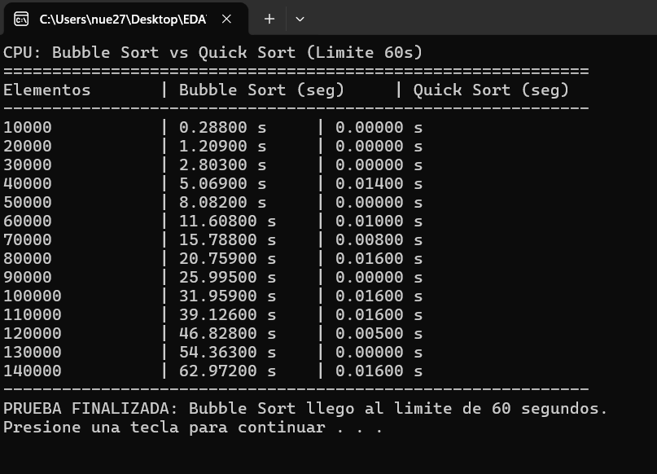
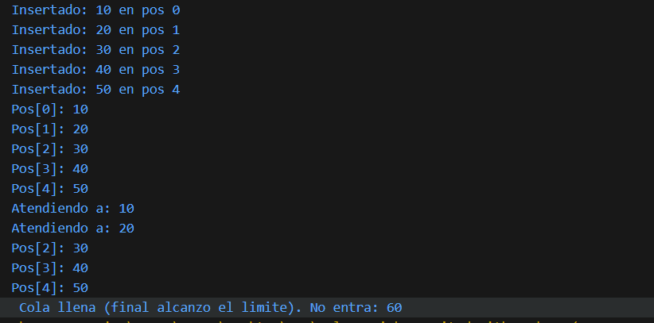
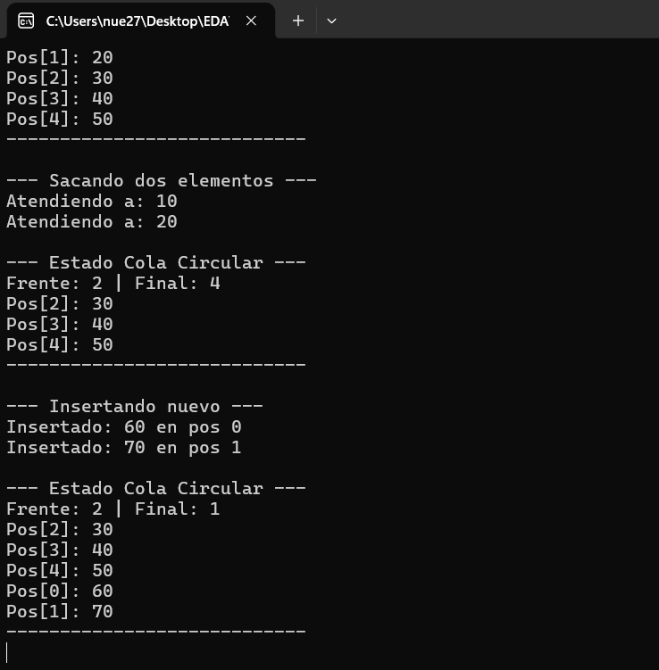
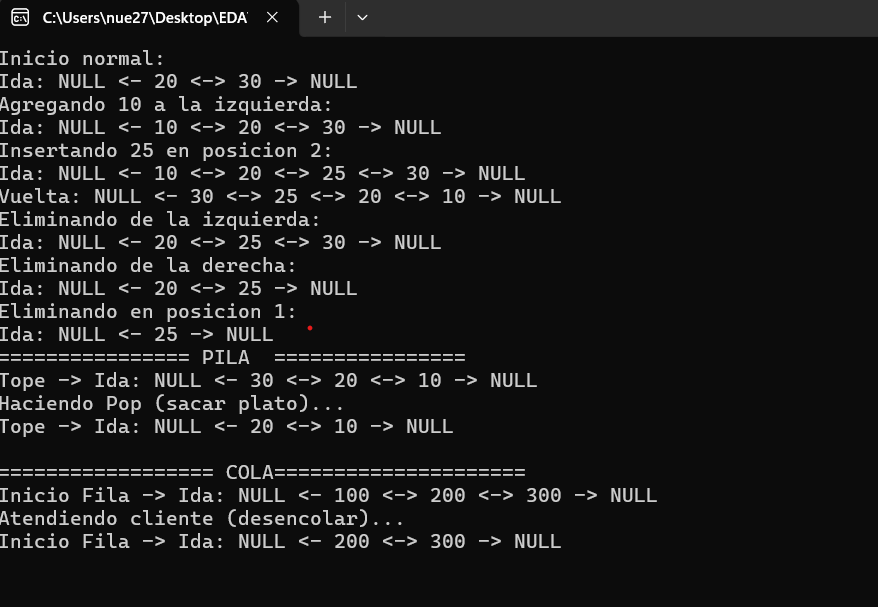
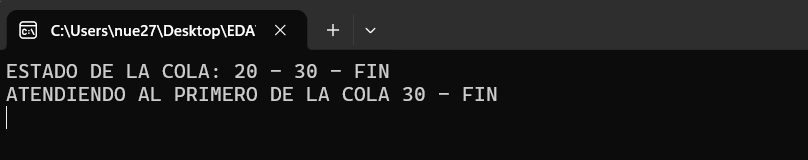
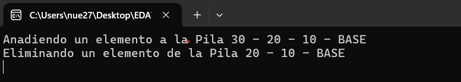
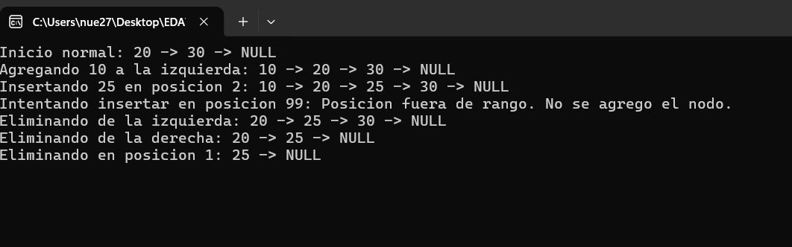
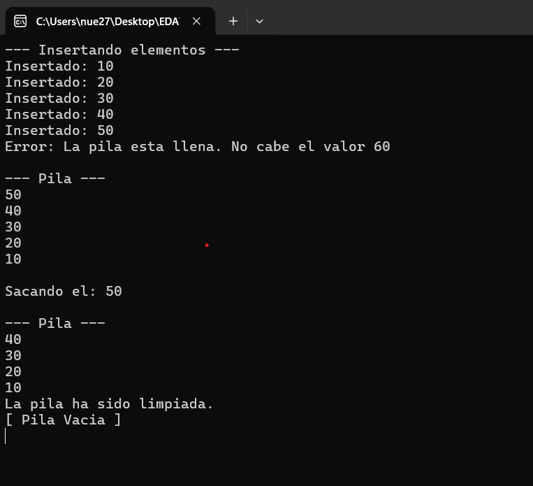

# CAPTURAS DE PANTALLA CORRESPONDIENTES A LOS EJERCICIOS ENCARGADOS

## Descripción
Este repositorio contiene los códigos encargados para la tarea de ESTRUCTURAS DE DATOS AVANZADAS.

## Capturas de Ejecución
Aquí se muestran los resultados de los programas:

### bublesort

### Cola

### Cola Circular

### Lista Doblemente Enlazada

### Lista Cola

### Lista Pila

### Lista Nodo

### pila
